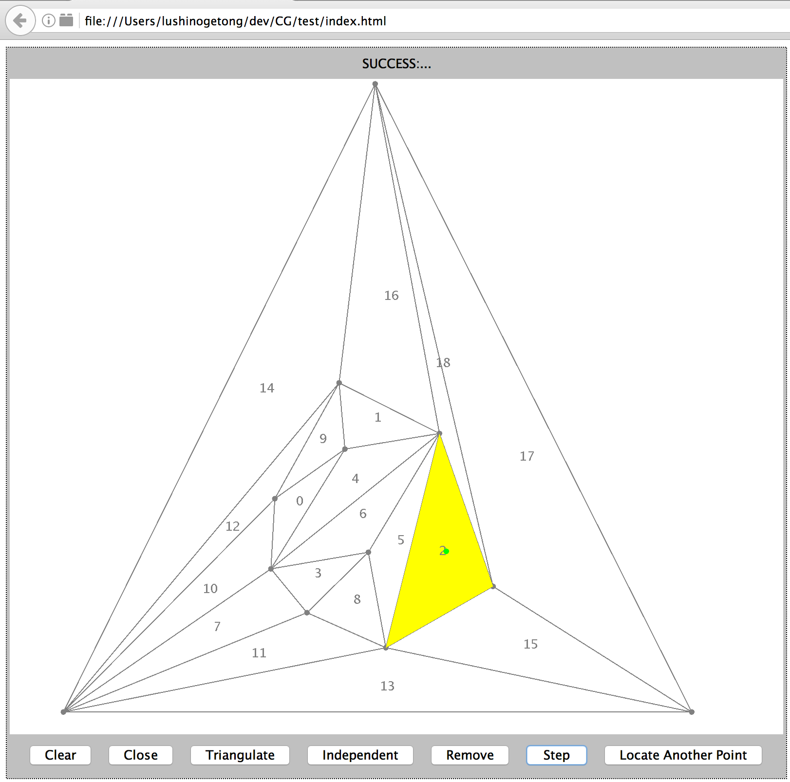

# Computational Geometry Projects
## Topic: Pedagogy (Graphical Applets)

## Description: 
In this project, we developed a java applet to implemented the Kirkpatrick’s point location algorithm and use a graphical interface to show the run-time procedure. 

## Usage:
Unarchive the project file, click the index.html in the “test” folder. And follow the instruction in that webpage.

1. Click inside the triangle to draw your own polygon. After you finish all of your vertices, click “Close” button to get a closed polygon

2. Click ”Triangulate” button to triangulate the entire polygon. 

3. Click “Independent” button to find the independent vertex and click “Remove” button to remove it from the polygon. Keep this operation until removing all the independent vertex

4. Click inside the triangle to get the query point (It should be indicated in Green)

5. Keep click “Step” button to get the location of the Point 

## Implementation 
In our project, we implement the Kirkpatrick’s point location algorithm. There are 2 main problems needs to be solved:
**1. Polygon Triangulation**
The triangulation algorithm is based on the earcut method. We use a java library to do this job. You can find it in [earcut4j](https://github.com/earcut4j/earcut4j)

**2. Point Location**
This part is totally implemented by ourselves. We use the standard Kirkpatrick’s algorithm as the professor Pless has taught in the class. 
We build a PlanarGraph (you can find the all the code in “src” folder) class to represent the whole graph. We store all the vertex, edge, and the corresponding triangle in it and implemented all corresponding method such as the addVertex, removeVertex, addDirectedEdge. 
We also build a DAG class to represent the parent/child relationship between all the triangle inside the PlanarGraph. That’s very useful in point location

## Distribution
SHAO-CHIANG TSAI: Polygon triangulation and the user interface

LINGTONG LU: Implementation of the point location algorithm. 